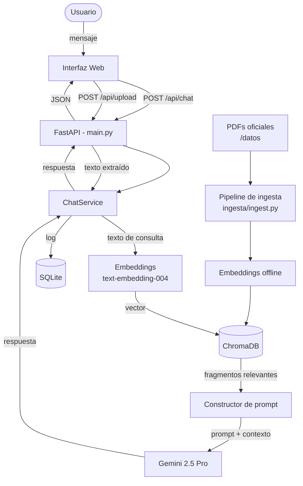
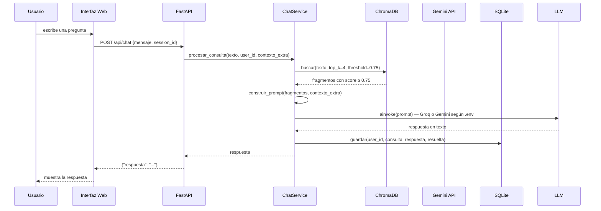
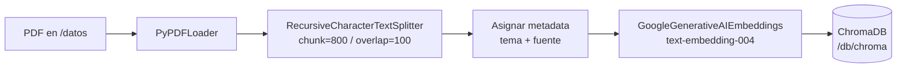

# Arquitectura del sistema — ADE-Bot

## 1. Diagrama general

---

## 2. Flujo de una consulta

---

## 3. Pipeline de ingesta (offline)

El script detecta el tema del documento por el nombre del archivo (ver README).

---

## 4. Decisiones de diseño

**Proveedor de LLM configurable**
`main.py` expone `_crear_llm_client()`: si `GROQ_API_KEY` está definida en `.env`, instancia `GroqLLMClient` (llama-3.3-70b por defecto); si no, usa `GeminiLLMClient`. Cambiar de proveedor no requiere tocar `ChatService`.

**Inyección de dependencias en `ChatService`**
`ChatService` recibe `VectorStore`, `LLMClient` y `LogRepository` como interfaces abstractas. Esto permite sustituirlos por fakes en las pruebas del Módulo 4 sin conexión a ningún proveedor externo.

**Contexto de sesión en memoria**
Los PDFs adjuntados por el usuario se almacenan en `_session_docs` (dict en proceso). Se pierden al reiniciar el servidor. No se persisten por diseño — son contexto temporal de la sesión.

**Fallback sin contexto**
Si ChromaDB no retorna fragmentos con score ≥ threshold y no hay documentos adjuntos, el sistema usa un prompt alternativo que indica al bot responder desde conocimiento general y aclarar que la respuesta no proviene de documentos oficiales.

**Threshold de similitud**
Un valor de 0.75 filtra fragmentos poco relacionados y reduce respuestas alucinadas. Si los PDFs no están ingestados, todas las búsquedas regresan vacías y el bot activa el fallback.
